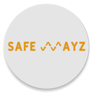
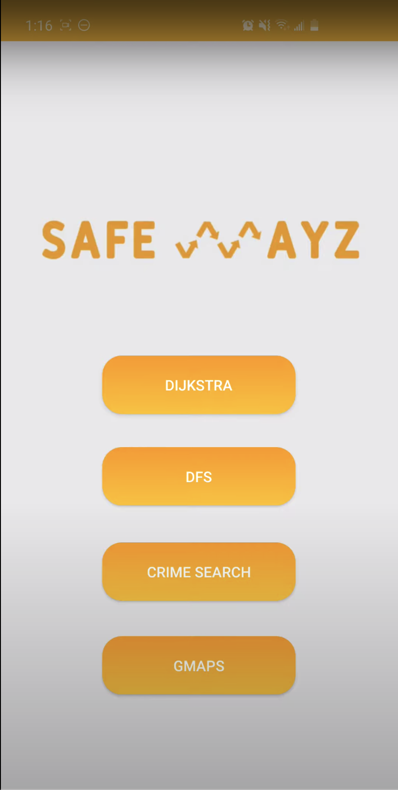

<!-- Massive Shoutout to othneildrew, douglascayers and DropNib 
*** for setting the foundations of this SafeWayz. Major credits to them! -->

<!--
*** To avoid retyping too much info. Do a search and replace for the following:
*** full_name, AdityaSharma6, SafeWayz, adityasharma6, Aditya_Sharma_@hotmail.com, https://www.linkedin.com/in/adityasharma6/
-->


<!-- PROJECT SHIELDS -->
<!--
*** I'm using markdown "reference style" links for readability.
*** Reference links are enclosed in brackets [ ] instead of parentheses ( ).
*** See the bottom of this document for the declaration of the reference variables
*** for contributors-url, forks-url, etc. This is an optional, concise syntax you may use.
*** https://www.markdownguide.org/basic-syntax/#reference-style-links
-->
[![Contributors][contributors-shield]][contributors-url]
[![Forks][forks-shield]][forks-url]
[![Stargazers][stars-shield]][stars-url]
[![Issues][issues-shield]][issues-url]
[![MIT License][license-shield]][license-url]
[![LinkedIn][linkedin-shield]][linkedin-url]


<!-- PROJECT LOGO -->
<br />
<p align="center">
  <a href="https://github.com/AdityaSharma6/SafeWayz">
    
  </a>

  <h3 align="center">SafeWayz</h3>

  <p align="center">
    SafeWayz is a mobile application that helps users find the safest route throughout the city of San Francisco!
    <br />
    <a href="https://github.com/AdityaSharma6/SafeWayz"><strong>Explore the docs »</strong></a>
    <br />
    <br />
    <a href="https://youtu.be/8cnLMpcupUE">View Demo</a>
    ·
    <a href="https://github.com/AdityaSharma6/SafeWayz/issues">Report Bug</a>
    ·
    <a href="https://github.com/AdityaSharma6/SafeWayz/issues">Request Feature</a>
  </p>
</p>


<!-- TABLE OF CONTENTS -->
## Table of Contents

* [About the Project](#about-the-project)
  * [Built With](#built-with)
  * [Team](#team-members)
* [Getting Started](#getting-started)
  * [Installation](#installation)
* [Usage](#usage)
* [Roadmap](#roadmap)
* [Contributing](#contributing)
* [License](#license)
* [Contact](#contact)
* [Acknowledgements](#acknowledgements)


<!-- ABOUT THE PROJECT -->
## About The Project
[](https://youtu.be/8cnLMpcupUE)

SafeWayz is a mobile application that helps users find the safest route throughout the city of San Francisco!

An Android mobile application as well as eclipse-terminal version are available for use.

The application was developed using the concepts of Data Structures & Algorithms and software development principles.

## Built With
* [Python](https://www.python.org/)
* [Pandas](https://pandas.pydata.org/)
* [Java](https://java.com/en/download/)
* [JUnit](https://junit.org/junit5/)
* [Google Maps API](https://developers.google.com/maps/documentation)
* [GSON API](https://javadoc.io/doc/com.google.code.gson/gson/latest/com.google.gson/module-summary.html)

Python and Pandas were used to perform Data Cleaning and Data Formatting. 

Java was used to build the android application as well as the algorithms being used: 
* Depth First Search (DFS)
* Breath First Search(BFS)
* Dijkstra's least crime algorithm
* QuickSort
* Binary Search

The Google Maps API was used to bring in core functionality into the mobile application. Finally, the GSON API was used to convert JSON files into Hashtables/ Dictionary Objects

## Team Members

* [Aditya Sharma](https://github.com/AdityaSharma6)
* [Anando Zaman](https://github.com/Anando304)
* [Daniel Di Cesare]()
* [Jash Mehta](https://github.com/mehtaj8)
* [Zachary Ren]()

<!-- GETTING STARTED -->
## Getting Started

To get a local copy up and running follow these simple steps.

### Android Application Installation 

1. Clone the SafeWayz
```sh
git clone https://github.com/AdityaSharma6/SafeWayz.git
```

#### Method 1
2. Install the APK File. It is located [here](https://github.com/AdityaSharma6/SafeWayz/tree/master/Android/APK). 
3. Copy this APK to your device internal storage. Then, using the file browser of your choice, install the application on your phone.

#### Method 2
2. Open this [folder](https://github.com/AdityaSharma6/SafeWayz/tree/master/Android/SafeWays) in Android Studio. The studio will automatically detect it and load the project.
3. Make sure to have installed Android Studio SDK with minimum Android Version of 5.0
4. For more indepth instructions, checkout the [QuickStart](https://github.com/AdityaSharma6/SafeWayz/tree/master/Instructions/Android-Instructions) guide.


### Eclipse Terminal Instructions
1. Import the project by unzipping the 2XB3_GR02_FinalProject.zip OR locate where the 2XB3_GR02_FinalProject folder is. [Link to folder](https://github.com/AdityaSharma6/SafeWayz/tree/master/JAVA-ECLIPSE-TERMINAL/2XB3_GR02_FinalProject)
2. Open up eclipse and then go to File -> “Open projects from File system…” - 2XB3_GR02_FinalProject
3. Import the necessary JARs located [here](https://github.com/AdityaSharma6/SafeWayz/tree/master/JAVA-ECLIPSE-TERMINAL/2XB3_GR02_FinalProject/src/final_proj/JarModules)
4. Once imported, you can run the Main method found in MainActivity.java located [here](https://github.com/AdityaSharma6/SafeWayz/tree/master/JAVA-ECLIPSE-TERMINAL/2XB3_GR02_FinalProject/src).
5. More detailed setup instructions can be found [here](https://github.com/AdityaSharma6/SafeWayz/tree/master/Instructions/Eclipse-Terminal-Instructions).


## Engineering Reports

Throughout the project, we needed to create several Engineering Reports. These reports can be found at this [location](https://github.com/AdityaSharma6/SafeWayz/tree/master/Engineering%20Reports)


<!-- ROADMAP -->
## Roadmap

See the [open issues](https://github.com/AdityaSharma6/SafeWayz/issues) for a list of proposed features (and known issues).


<!-- CONTRIBUTING -->


## Contributing

Contributions are what make the open source community such an amazing place to be learn, inspire, and create. Any contributions you make are **greatly appreciated**.

1. Fork the Project
2. Create your Feature Branch (`git checkout -b feature/AmazingFeature`)
3. Commit your Changes (`git commit -m 'Add some AmazingFeature'`)
4. Push to the Branch (`git push origin feature/AmazingFeature`)
5. Open a Pull Request


<!-- LICENSE -->
## License

Distributed under the MIT License. See `LICENSE` for more information.


<!-- CONTACT -->
## Contact

AdityaSharma - [@AdityaSharma6](https://www.linkedin.com/in/adityasharma6/) - Aditya_Sharma_@hotmail.com

Project Link: [https://github.com/AdityaSharma6/SafeWayz](https://github.com/AdityaSharma6/SafeWayz)


<!-- ACKNOWLEDGEMENTS -->
## Acknowledgements

* [othneildrew](https://github.com/othneildrew/Best-README-Template)


<!-- MARKDOWN LINKS & IMAGES -->
<!-- https://www.markdownguide.org/basic-syntax/#reference-style-links -->
[contributors-shield]: https://img.shields.io/github/contributors/AdityaSharma6/SafeWayz.svg?style=flat-square

[contributors-url]: https://github.com/AdityaSharma6/SafeWayz/graphs/contributors

[forks-shield]: https://img.shields.io/github/forks/AdityaSharma6/SafeWayz.svg?style=flat-square

[forks-url]: https://github.com/AdityaSharma6/SafeWayz/network/members

[stars-shield]: https://img.shields.io/github/stars/AdityaSharma6/SafeWayz.svg?style=flat-square

[stars-url]: https://github.com/AdityaSharma6/SafeWayz/stargazers

[issues-shield]: https://img.shields.io/github/issues/AdityaSharma6/SafeWayz.svg?style=flat-square

[issues-url]: https://github.com/AdityaSharma6/SafeWayz/issues

[license-shield]: https://img.shields.io/github/license/AdityaSharma6/SafeWayz.svg?style=flat-square

[license-url]: https://github.com/AdityaSharma6/SafeWayz/blob/master/LICENSE.txt

[linkedin-shield]: https://img.shields.io/badge/-LinkedIn-black.svg?style=flat-square&logo=linkedin&colorB=555

[linkedin-url]: https://www.linkedin.com/in/AdityaSharma6/

[product-screenshot]: Readme_Images/screenshot.png
